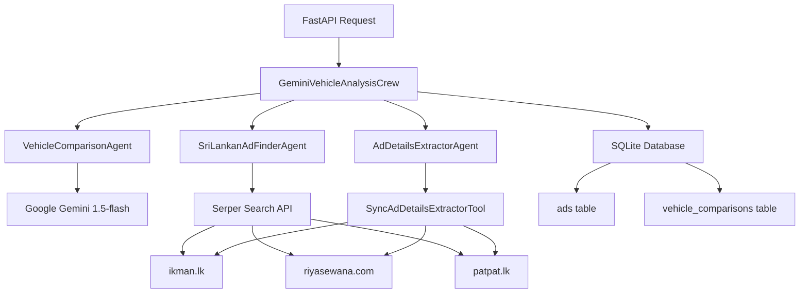

# AI Vehicle Comparison System - Backend Entity-Relationship Documentation

## Overview

This document provides comprehensive entity-relationship information for the AI Vehicle Comparison System backend, detailing data structures, API interactions, and requirements based on the current production implementation designed for intelligent vehicle analysis and advertisement extraction using a sophisticated multi-agent system.

## System Architecture

### Current Agentic System Architecture

The system employs a **CrewAI-based multi-agent architecture** powered by **Google Gemini 1.5-flash** as the primary LLM provider, orchestrating specialized AI agents for different aspects of vehicle analysis:



### Agentic System Flow

1. **User Input** → Vehicle Analysis Request (FastAPI `/api/v1/analyze-vehicles`)
2. **Crew Initialization** → GeminiVehicleAnalysisCrew with API key validation
3. **Agent Orchestration** → CrewAI sequential process coordination
4. **Parallel Task Execution**:
   - **VehicleComparisonAgent** → Technical analysis using Google Gemini
   - **SriLankanAdFinderAgent** → Ad URL discovery via Serper + site-specific scraping
   - **AdDetailsExtractorAgent** → Structured data extraction using BeautifulSoup
5. **Database Operations** → SQLite storage with session tracking and deduplication
6. **Response Assembly** → Structured JSON with markdown comparison report
7. **Error Handling** → Comprehensive fallback and logging systems

### Current LLM Provider Configuration

**Primary Provider**: Google Gemini 1.5-flash (default priority)
- Model: `gemini-1.5-flash`
- Configuration: `LLM_PROVIDER=gemini`
- Environment: `GEMINI_API_KEY`, `GOOGLE_API_KEY`
- Status: Free tier with generous quotas, preferred for cost efficiency
- Routing: Direct Google AI Studio API via LangChain
- API Validation: Comprehensive key validation with connection testing

### Simplified Crew Selection Logic (Current Implementation)

```python
async def _select_optimal_crew(vehicle1: str, vehicle2: str):
    """
    Select the Gemini crew for vehicle analysis
    Uses the free Gemini API with generous quotas
    """
    
    # Check if Gemini API key is configured
    if not settings.GEMINI_API_KEY or settings.GEMINI_API_KEY == "your_gemini_api_key_here":
        logger.error("Gemini API key not configured", 
                    vehicle1=vehicle1, vehicle2=vehicle2)
        raise ValueError("GEMINI_API_KEY is not properly configured.")
    
    try:
        logger.info("Selecting Gemini crew (free tier with generous quotas)", 
                   vehicle1=vehicle1, vehicle2=vehicle2, 
                   provider="google-gemini", model=settings.GEMINI_MODEL)
        return GeminiVehicleAnalysisCrew(vehicle1, vehicle2)
    except Exception as e:
        logger.error("Gemini crew initialization failed", 
                    error=str(e), error_type=type(e).__name__,
                    vehicle1=vehicle1, vehicle2=vehicle2)
        raise
```

### Agent Workflow with Multi-LLM Support

```
VehicleComparisonAgent (Expert Car Reviewer)
├── LLM: Gemini 1.5-flash (configurable)
├── Uses: Custom SearchTool (Serper API) for web search
├── Output: Markdown-formatted comparison report
├── Process: Technical specs, reliability, pros/cons analysis
└── Fallback: Mock comparison report on API failure

SriLankanAdFinderAgent (Local Market Analyst)
├── LLM: Gemini 1.5-flash (configurable)
├── Uses: Custom SearchTool and SriLankanScraperTool for ikman.lk & riyasewana.com
├── Intelligence: Distinguishes individual ad URLs from search pages
├── Output: List of individual advertisement URLs (not search pages)
└── Process: Targeted search with site-specific URL patterns

AdDetailsExtractorAgent (Ad Data Extractor)
├── LLM: Gemini 1.5-flash (configurable)
├── Uses: SyncAdDetailsExtractorTool with BeautifulSoup
├── Output: JSON objects with structured ad data
├── Process: Extracts price, location, mileage, year from ad pages
└── Fallback: Uses robust error handling
```

### Web Scraping Intelligence

**Intelligent Mileage Interpretation**:
- Converts abbreviated forms: "just 50" → "50,000 km"
- Context-aware: "only 25km" → "25,000 km"
- Pattern recognition: Handles various seller notation styles
- Maintains original if already properly formatted

**Ad URL Distinction**:
- Individual ads: `https://ikman.lk/en/ad/honda-fit-gp5-2013-for-sale-colombo-12345`
- Avoids search pages: `https://ikman.lk/en/ads/sri-lanka/cars/honda/fit`
- Site-specific patterns for ikman.lk and riyasewana.com

## Entities

### 1. Vehicle Analysis Request

**Database Schema**: Not persisted (API request only)

```typescript
interface VehicleAnalysisRequest {
  vehicle1: string;  // Required, non-empty
  vehicle2: string;  // Required, non-empty
}
```

**Validation Rules**:
- Both fields are mandatory
- Minimum length: 2 characters
- Maximum length: 100 characters
- Special characters allowed: spaces, hyphens, parentheses

**Frontend Form Requirements**:
- Input type: text
- Placeholder examples: "Toyota Aqua", "Honda Fit"
- Auto-complete suggestions (optional)
- Real-time validation feedback

**Sample Valid Inputs**:
```json
{
  "vehicle1": "Toyota Aqua",
  "vehicle2": "Honda Fit"
}
```

**User Vehicle Request Capabilities**:
Users can request research on ANY specific vehicle models available in the Sri Lankan market:

- **Popular Japanese Models**: "Toyota Aqua", "Honda Fit", "Suzuki Alto", "Nissan March"
- **Hybrid Vehicles**: "Toyota Prius", "Honda Vezel", "Toyota CH-R"
- **Luxury Vehicles**: "BMW 320i", "Mercedes C200", "Audi A4"
- **SUVs**: "Toyota Fortuner", "Mitsubishi Pajero", "Honda CR-V"
- **Budget Cars**: "Perodua Axia", "Suzuki Wagon R", "Daihatsu Mira"
- **Commercial Vehicles**: "Toyota Hiace", "Nissan Caravan", "Isuzu D-Max"

**Dynamic Vehicle Processing**:
- The system accepts any vehicle name as string input
- AI agents dynamically research the requested vehicles
- No pre-defined vehicle database - uses real-time web search
- Supports various naming formats (e.g., "Honda Fit", "Honda Fit Hybrid", "Fit GP5")

### 2. Advertisement (Ad)

**Database Schema**: `ads` table (SQLite)

```sql
CREATE TABLE ads (
    id INTEGER PRIMARY KEY,
    title VARCHAR(255),
    price VARCHAR(100),
    location VARCHAR(100),
    mileage VARCHAR(50),
    year VARCHAR(10),
    link VARCHAR(500) UNIQUE NOT NULL,
    analysis_session_id VARCHAR(255),
    vehicle_name VARCHAR(255),
    comparison_id INTEGER,
    created_at DATETIME DEFAULT CURRENT_TIMESTAMP,
    FOREIGN KEY (comparison_id) REFERENCES vehicle_comparisons (id)
);
```

**SQLAlchemy Model** (Current Implementation):
```python
class Ad(Base):
    __tablename__ = "ads"

    id = Column(Integer, primary_key=True, index=True)
    title = Column(String, index=True)
    price = Column(String)
    location = Column(String)
    mileage = Column(String)
    year = Column(String)
    link = Column(String, unique=True, index=True)
    analysis_session_id = Column(String, index=True)  # Links ads to analysis sessions
    vehicle_name = Column(String, index=True)  # Which vehicle this ad is for
    comparison_id = Column(Integer, ForeignKey("vehicle_comparisons.id"), nullable=True)
    created_at = Column(DateTime(timezone=True), server_default=func.now())
    
    # Relationship to comparison - temporarily disabled to avoid circular import issues
    # comparison = relationship("VehicleComparison", back_populates="ads")
```

**Pydantic Schema**:
```typescript
interface AdDetails {
  id?: number;           // Auto-generated (database only)
  title: string;         // Ad headline
  price: string;         // Format: "LKR 6,500,000" or "Not Found"
  location: string;      // City/area in Sri Lanka
  mileage: string;       // Format: "45,000 km" or "Not Found"
  year: string;          // Manufacturing year or "Not Found"
  link: string;          // Full URL to original ad
}
```

**Data Formats**:
- **Price**: "LKR 6,500,000", "Rs. 2,800,000", "Negotiable", "Not Found"
- **Location**: "Colombo", "Kandy", "Galle", "Negombo", etc.
- **Mileage**: "45,000 km", "120,000 Km", "Not Found"
- **Year**: "2018", "2015", "Not Found"
- **Link**: Full URLs from ikman.lk, riyasewana.com

**Database Operations**:
- **CRUD**: Full Create, Read, Update, Delete operations via `ad_crud.py`
- **Deduplication**: Unique constraint on `link` field prevents duplicates
- **Filtering**: Support for price range, year, location filters
- **Statistics**: Price analysis (min, max, average) via `ad_stats.py`

**Frontend Display Requirements**:
- Price formatting with currency symbol
- Location with map integration (optional)
- Mileage with unit display
- Year validation (reasonable range: 1990-2024)
- Clickable links opening in new tab

### 3. Vehicle Comparison (Database Entity)

**Database Schema**: `vehicle_comparisons` table (SQLite)

```sql
CREATE TABLE vehicle_comparisons (
    id INTEGER PRIMARY KEY,
    analysis_session_id VARCHAR(255) UNIQUE,
    vehicle1 VARCHAR(255),
    vehicle2 VARCHAR(255),
    comparison_report TEXT,
    metadata_info TEXT,
    created_at DATETIME DEFAULT CURRENT_TIMESTAMP,
    updated_at DATETIME
);
```

**SQLAlchemy Model** (Current Implementation):
```python
class VehicleComparison(Base):
    __tablename__ = "vehicle_comparisons"

    id = Column(Integer, primary_key=True, index=True)
    analysis_session_id = Column(String, unique=True, index=True)  # Unique session identifier
    vehicle1 = Column(String, index=True)
    vehicle2 = Column(String, index=True)
    comparison_report = Column(Text)
    metadata_info = Column(Text)  # JSON string for additional metadata
    created_at = Column(DateTime(timezone=True), server_default=func.now())
    updated_at = Column(DateTime(timezone=True), onupdate=func.now())
    
    # Relationship to ads - temporarily disabled to avoid circular import issues
    # ads = relationship("Ad", back_populates="comparison")
```

**Features**:
- **Session Tracking**: Each analysis gets a unique session ID for linking ads and comparison
- **Metadata Storage**: JSON string field for storing additional analysis metadata
- **Audit Trail**: Created and updated timestamps for tracking
- **Relationship**: Foreign key relationship with ads table

### 4. Vehicle Analysis Response

**Database Schema**: Not persisted (API response only)

```typescript
interface VehicleAnalysisResponse {
  comparison_report: string;        // Markdown-formatted report
  vehicle1_ads: AdDetails[];       // Array of ads for first vehicle
  vehicle2_ads: AdDetails[];       // Array of ads for second vehicle
}
```

**Comparison Report Structure**:
The mock crew generates realistic comparison reports with the following structure:

```markdown
# Vehicle Comparison: Toyota Aqua vs Honda Fit

## Executive Summary
Both vehicles are popular compact cars in the Sri Lankan market...

## Technical Specifications
### Toyota Aqua
- Engine: 1.2L 3-cylinder petrol engine
- Fuel Economy: 5.2 L/100km (19.2 km/l)
- Power: 79 HP @ 6,000 rpm
- Transmission: CVT Automatic

### Honda Fit
- Engine: 1.3L 4-cylinder petrol engine
- Fuel Economy: 5.8 L/100km (17.2 km/l)
- Power: 100 HP @ 6,000 rpm
- Transmission: CVT Automatic

## Reliability & Maintenance
### Toyota Aqua
**Strengths:** Simple, reliable 3-cylinder engine...
**Common Issues:** CVT transmission can be jerky...
**Maintenance Cost:** LKR 15,000 - 25,000 per service

### Honda Fit
**Strengths:** Proven 4-cylinder engine reliability...
**Common Issues:** Higher fuel consumption...
**Maintenance Cost:** LKR 18,000 - 30,000 per service

## Pros and Cons
...detailed pros and cons for each vehicle...

## Market Positioning in Sri Lanka
...market analysis, target buyers, price ranges...

## Final Recommendation
...personalized recommendations based on use case...

## Overall Rating
### Toyota Aqua: 7.5/10
### Honda Fit: 8.2/10
```

**Frontend Rendering Requirements**:
- Markdown parser (react-markdown recommended)
- Responsive table layouts for specifications
- Collapsible sections for better UX
- Side-by-side comparison view

### 4. Vehicle Ads Stats (Additional Feature)

**Request Schema**:
```typescript
interface VehicleAdsStatsRequest {
  ads: AdDetails[];
  min_price?: number;
  max_price?: number;
  year?: number;
  location?: string;
}
```

**Response Schema**:
```typescript
interface VehicleAdsStatsResponse {
  ads: AdDetails[];      // Filtered ads
  stats: {
    count: number;
    min_price: number | null;
    max_price: number | null;
    avg_price: number | null;
  };
}
```

**Price Parsing Logic**:
```python
def parse_price(price_str):
    # Extract numeric value from "LKR 6,500,000"
    match = re.search(r'([\d,]+)', price_str.replace(',', ''))
    if match:
        return int(match.group(1).replace(',', ''))
    return None
```

## API Endpoints

### 1. Analyze Vehicles (Primary Endpoint)

**Endpoint**: `POST /api/v1/analyze-vehicles`

**Request**:
```json
{
  "vehicle1": "Toyota Aqua",
  "vehicle2": "Honda Fit"
}
```

**Response** (Success - 200):
```json
{
  "comparison_report": "# Vehicle Comparison: Toyota Aqua vs Honda Fit\n\n## Executive Summary...",
  "vehicle1_ads": [
    {
      "title": "Toyota Aqua 2018 - Excellent Condition",
      "price": "LKR 6,500,000",
      "location": "Colombo",
      "mileage": "45,000 km",
      "year": "2018",
      "link": "https://ikman.lk/en/ad/toyota-aqua-2018-..."
    }
  ],
  "vehicle2_ads": [...]
}
```

**Error Responses**:
```json
// 400 Bad Request
{
  "detail": "Both vehicle1 and vehicle2 must be provided."
}

// 500 Internal Server Error
{
  "detail": "An internal server error occurred."
}
```

### 2. Vehicle Ads Statistics

**Endpoint**: `POST /api/v1/vehicle-ads-stats`

**Query Parameters**:
- `min_price`: integer (optional) - Minimum price filter
- `max_price`: integer (optional) - Maximum price filter  
- `year`: integer (optional) - Manufacturing year filter
- `location`: string (optional) - Location filter (partial match)

**Request Body**:
```json
{
  "ads": [
    {
      "title": "Toyota Aqua 2018",
      "price": "LKR 6,500,000",
      "location": "Colombo",
      "mileage": "45,000 km",
      "year": "2018",
      "link": "https://ikman.lk/..."
    }
  ]
}
```

**Response**:
```json
{
  "ads": [...],
  "stats": {
    "count": 5,
    "min_price": 4500000,
    "max_price": 7200000,
    "avg_price": 5850000
  }
}
```

### 3. Health Check

**Endpoint**: `GET /`

**Response**:
```json
{
  "message": "Welcome to the AI Vehicle Analyst API"
}
```

### 4. Advanced Health Check

**Endpoint**: `GET /api/v1/health`

**Response**:
```json
{
  "status": "healthy",
  "timestamp": "2025-08-01T14:55:32Z",
  "version": "1.0.0",
  "services": {
    "api": "operational",
    "openai_configured": true,
    "serper_configured": true,
    "mock_mode": false
  }
}
```

### 5. OpenAI Connection Test

**Endpoint**: `POST /api/v1/test-openai`

**Response**:
```json
{
  "status": "success",
  "message": "OpenAI API connection successful",
  "model": "gpt-3.5-turbo",
  "response": "OK",
  "tokens_used": 5
}
```

## Current Technical Implementation

### Backend Dependencies

**Core Framework**:
- `fastapi>=0.104.1` - Web framework for API development
- `uvicorn[standard]>=0.24.0` - ASGI server for FastAPI
- `pydantic>=2.5.0` - Data validation and serialization

**AI/ML Stack**:
- `crewai>=0.150.0` - Multi-agent orchestration framework
- `crewai[tools]>=0.150.0` - CrewAI tools extension
- `litellm>=1.0.0` - Unified LLM API interface

**LLM Providers**:
- `langchain-openai>=0.1.0` - OpenAI integration
- `langchain-google-genai>=1.0.0` - Google Gemini integration
- `google.generativeai` - Direct Google Gemini API access

**Web Scraping & Automation**:
- `playwright>=1.40.0` - Browser automation for ad scraping
- `requests>=2.31.0` - HTTP client for API calls
- `beautifulsoup4>=4.12.0` - HTML parsing

**Database & Storage**:
- `SQLAlchemy>=2.0.0` - ORM for database operations
- `alembic>=1.13.0` - Database migration management

**Configuration & Environment**:
- `python-dotenv>=1.0.0` - Environment variable management

**Logging & Monitoring**:
- `structlog>=23.2.0` - Structured logging
- `coloredlogs>=15.0.1` - Enhanced log formatting

**Utilities**:
- `click>=8.1.0` - CLI tool development
- `python-multipart>=0.0.6` - Form data handling
- `typing-extensions>=4.8.0` - Extended type hints
- `markdown>=3.5.0` - Markdown processing

### Environment Configuration

**Required Environment Variables**:
```bash
# LLM Provider Configuration
LLM_PROVIDER=gemini  # gemini, openai, or auto

# OpenAI Configuration (Secondary)
OPENAI_API_KEY=your_openai_api_key_here

# Google Gemini Configuration (Primary)
GEMINI_API_KEY=your_gemini_api_key_here
GOOGLE_API_KEY=your_gemini_api_key_here  # Same as GEMINI_API_KEY
GEMINI_MODEL=gemini-1.5-flash

# Search Tool Configuration
SERPER_API_KEY=your_serper_api_key_here

# Mock Mode Configuration (for testing)
USE_MOCK_CREW=false  # Set to true to force mock mode

# Database Configuration
DATABASE_URL=sqlite:///./ads.db
```

### Project Structure (Current Implementation)

```
backend/
├── app/
│   ├── __init__.py
│   ├── main.py                      # FastAPI application with intelligent crew selection
│   ├── gemini_crew.py               # Primary Gemini crew configuration with LiteLLM routing
│   ├── tasks.py                     # Task definitions for all agents
│   ├── agents/
│   │   ├── __init__.py
│   │   ├── comparison_agent.py      # Vehicle comparison agent
│   │   ├── ad_finder_agent.py       # Ad finding agent with URL intelligence
│   │   ├── details_extractor_agent.py # Ad details extraction agent
│   │   └── mcp_enhanced_agent.py    # MCP-enhanced agent with tool support
│   ├── tools/
│   │   ├── __init__.py
│   │   ├── search_helper.py         # Search helper utilities
│   │   ├── search_tool.py           # Custom Serper search tool with AI-friendly output
│   │   ├── sri_lankan_scraper.py    # SriLankan website scraper (ikman.lk, riyasewana.com, patpat.lk)
│   │   ├── sync_ad_details_tool.py  # Synchronous ad details extractor
│   │   └── sync_beautifulsoup_scraper.py # BeautifulSoup-based scraper
│   ├── schemas/
│   │   ├── __init__.py
│   │   └── vehicle_schemas.py       # Pydantic models for API
│   ├── models/
│   │   ├── __init__.py
│   │   ├── ad.py                    # SQLAlchemy Ad model with session tracking
│   │   └── comparison.py            # VehicleComparison model for storing analysis results
│   ├── crud/
│   │   ├── __init__.py
│   │   ├── ad_crud.py               # Ad CRUD operations with filtering
│   │   └── comparison_crud.py       # Vehicle comparison CRUD operations
│   ├── utils/
│   │   └── ad_stats.py              # Ad statistics and price parsing
│   └── core/
│       ├── __init__.py
│       ├── config.py                # Configuration with LLM provider selection
│       └── db.py                    # Database configuration
├── debugging/
│   ├── README.md                    # Debugging documentation
│   ├── api debugging/
│   │   └── test_gemini_direct.py    # Direct Gemini API testing
│   ├── db debugging/
│   │   ├── force_clear_db.py        # Database clearing utility
│   │   ├── init_db.py               # Database initialization script
│   │   ├── inspect_ads_db.py        # Database inspection tool
│   │   └── query_ads_db.py          # Database query utility
│   └── tools debugging/
│       ├── test_detailed_scraper.py # Detailed scraper testing
│       ├── test_scraper.py          # Basic scraper testing
│       ├── test_simple_extractor.py # Simple extractor testing
│       ├── test_sri_lankan_scraper.py # Sri Lankan scraper testing
│       ├── test_sync_extractor.py   # Sync extractor testing
│       └── test_sync_scraper.py     # Sync scraper testing
├── .gitignore                       # Git ignore rules
├── ads.db                           # SQLite database file
├── ER_backend.md                    # Backend engineering requirements (this document)
├── mcp-config.json                  # MCP configuration
├── README.md                        # Comprehensive documentation
├── requirements.txt                 # Python dependencies
└── run.md                           # Quick run instructions
```

### Intelligent Features

**1. Smart Crew Selection**:
- Automatic LLM provider selection based on availability
- Cost-optimized: prefers free Gemini over paid OpenAI
- Graceful degradation to mock mode on failures

**2. Intelligent Web Scraping**:
- Context-aware mileage interpretation
- Ad URL vs search page distinction
- Robust error handling with "Not Found" fallbacks

**3. Database Intelligence**:
- Automatic ad deduplication via unique link constraint
- Price parsing with regex for statistics
- Flexible filtering by price, year, location

**4. Error Resilience**:
- Multiple layers of fallback (LLM → Mock → Error)
- Comprehensive logging with structured data
- API error detection and automatic recovery

## Frontend Component Structure

### Recommended React Components

```tsx
// Main comparison page
function VehicleComparisonPage() {
  return (
    <div>
      <VehicleSelectionForm />
      <ComparisonResults />
      <SystemStatus />
    </div>
  );
}

// Vehicle input form with validation
function VehicleSelectionForm() {
  const [vehicle1, setVehicle1] = useState('');
  const [vehicle2, setVehicle2] = useState('');
  const [loading, setLoading] = useState(false);
  const [error, setError] = useState<string | null>(null);
  
  // Form validation and submission logic
  const validateInput = (vehicle: string) => {
    if (!vehicle.trim()) return 'Vehicle name is required';
    if (vehicle.length < 2) return 'Minimum 2 characters required';
    if (vehicle.length > 100) return 'Maximum 100 characters allowed';
    return null;
  };

  const handleSubmit = async (e: React.FormEvent) => {
    e.preventDefault();
    
    const v1Error = validateInput(vehicle1);
    const v2Error = validateInput(vehicle2);
    
    if (v1Error || v2Error) {
      setError(v1Error || v2Error);
      return;
    }

    setLoading(true);
    setError(null);
    
    try {
      const response = await fetch('/api/v1/analyze-vehicles', {
        method: 'POST',
        headers: { 'Content-Type': 'application/json' },
        body: JSON.stringify({ vehicle1, vehicle2 }),
      });
      
      if (!response.ok) {
        const errorData = await response.json();
        throw new Error(errorData.detail || 'Analysis failed');
      }
      
      const data = await response.json();
      setComparisonData(data);
    } catch (err) {
      setError(err instanceof Error ? err.message : 'Unknown error');
    } finally {
      setLoading(false);
    }
  };

  return (
    <form onSubmit={handleSubmit}>
      <div>
        <input
          type="text"
          placeholder="First vehicle (e.g., Toyota Aqua)"
          value={vehicle1}
          onChange={(e) => setVehicle1(e.target.value)}
          required
        />
      </div>
      <div>
        <input
          type="text"
          placeholder="Second vehicle (e.g., Honda Fit)"
          value={vehicle2}
          onChange={(e) => setVehicle2(e.target.value)}
          required
        />
      </div>
      {error && <div className="error">{error}</div>}
      <button type="submit" disabled={loading}>
        {loading ? 'Analyzing...' : 'Compare Vehicles'}
      </button>
    </form>
  );
}

// Results display with markdown rendering
function ComparisonResults({ data }: { data: VehicleAnalysisResponse }) {
  return (
    <div>
      <ComparisonReport report={data.comparison_report} />
      <AdsSection title="Vehicle 1 Ads" ads={data.vehicle1_ads} />
      <AdsSection title="Vehicle 2 Ads" ads={data.vehicle2_ads} />
      <AdsStatistics ads={[...data.vehicle1_ads, ...data.vehicle2_ads]} />
    </div>
  );
}

// Markdown report rendering
function ComparisonReport({ report }: { report: string }) {
  return (
    <div className="comparison-report">
      <ReactMarkdown>{report}</ReactMarkdown>
    </div>
  );
}

// Ad listings with smart formatting
function AdsSection({ title, ads }: { title: string; ads: AdDetails[] }) {
  return (
    <section>
      <h2>{title}</h2>
      <div className="ads-grid">
        {ads.map((ad, index) => (
          <AdCard key={index} ad={ad} />
        ))}
      </div>
    </section>
  );
}

// Individual ad card with intelligent display
function AdCard({ ad }: { ad: AdDetails }) {
  const formatPrice = (price: string) => {
    if (price === "Not Found" || price === "Negotiable") return price;
    return price; // Already formatted by backend
  };

  const formatMileage = (mileage: string) => {
    if (mileage === "Not Found") return "Mileage not specified";
    return mileage; // Already processed by intelligent parser
  };

  return (
    <div className="ad-card">
      <h3>{ad.title}</h3>
      <div className="price">{formatPrice(ad.price)}</div>
      <div className="location">📍 {ad.location}</div>
      <div className="details">
        <span>{ad.year}</span> • <span>{formatMileage(ad.mileage)}</span>
      </div>
      <a 
        href={ad.link} 
        target="_blank" 
        rel="noopener noreferrer"
        className="view-details-btn"
      >
        View Details
      </a>
    </div>
  );
}

// System status indicator
function SystemStatus() {
  const [healthStatus, setHealthStatus] = useState(null);

  useEffect(() => {
    fetch('/api/v1/health')
      .then(res => res.json())
      .then(data => setHealthStatus(data))
      .catch(() => setHealthStatus({ status: 'error' }));
  }, []);

  if (!healthStatus) return null;

  return (
    <div className={`system-status ${healthStatus.status}`}>
      <span>System Status: {healthStatus.status}</span>
      {healthStatus.services?.mock_mode && (
        <span className="mock-indicator">Running in Mock Mode</span>
      )}
    </div>
  );
}

// Ad statistics component
function AdsStatistics({ ads }: { ads: AdDetails[] }) {
  const [stats, setStats] = useState(null);

  useEffect(() => {
    if (ads.length === 0) return;

    fetch('/api/v1/vehicle-ads-stats', {
      method: 'POST',
      headers: { 'Content-Type': 'application/json' },
      body: JSON.stringify({ ads }),
    })
      .then(res => res.json())
      .then(data => setStats(data.stats))
      .catch(() => setStats(null));
  }, [ads]);

  if (!stats || stats.count === 0) return null;

  return (
    <div className="ads-statistics">
      <h3>Market Statistics</h3>
      <div className="stats-grid">
        <div>Total Ads: {stats.count}</div>
        {stats.min_price && <div>Min Price: LKR {stats.min_price.toLocaleString()}</div>}
        {stats.max_price && <div>Max Price: LKR {stats.max_price.toLocaleString()}</div>}
        {stats.avg_price && <div>Avg Price: LKR {stats.avg_price.toLocaleString()}</div>}
      </div>
    </div>
  );
}
```

### State Management

```tsx
// Context for global state management
const VehicleComparisonContext = createContext();

function VehicleComparisonProvider({ children }) {
  const [comparisonData, setComparisonData] = useState<VehicleAnalysisResponse | null>(null);
  const [loading, setLoading] = useState(false);
  const [error, setError] = useState<string | null>(null);
  const [systemHealth, setSystemHealth] = useState(null);

  const analyzeVehicles = async (vehicle1: string, vehicle2: string) => {
    setLoading(true);
    setError(null);
    
    try {
      const response = await fetch('/api/v1/analyze-vehicles', {
        method: 'POST',
        headers: { 'Content-Type': 'application/json' },
        body: JSON.stringify({ vehicle1, vehicle2 }),
      });
      
      if (!response.ok) {
        const errorData = await response.json();
        throw new Error(errorData.detail || 'Analysis failed');
      }
      
      const data = await response.json();
      setComparisonData(data);
    } catch (err) {
      setError(err instanceof Error ? err.message : 'Unknown error');
    } finally {
      setLoading(false);
    }
  };

  return (
    <VehicleComparisonContext.Provider value={{
      comparisonData,
      loading,
      error,
      systemHealth,
      analyzeVehicles,
      setError
    }}>
      {children}
    </VehicleComparisonContext.Provider>
  );
}
```

## UI/UX Considerations

### Loading States
- Show spinner during API calls (can take 30-60 seconds for real analysis)
- Progress indicators for different agent stages
- Disable form submission during processing
- Mock mode responses are faster (3 seconds) for testing

### Error Handling
- Network errors with retry suggestions
- API validation errors with specific field feedback
- Agent processing failures with fallback indication
- Empty results handling with helpful messages
- Mock mode indicators when system falls back

### Responsive Design
- Mobile-first approach for Sri Lankan users
- Collapsible comparison sections on smaller screens
- Horizontal scrolling for ad cards
- Touch-friendly interface elements
- Optimized for slow internet connections

### Performance Optimization
- Lazy loading for ad images (when available)
- Debounced form inputs to prevent excessive validation
- Memoized components to prevent unnecessary re-renders
- Virtual scrolling for large ad lists
- Efficient markdown parsing for comparison reports

### Accessibility
- Proper semantic HTML structure
- ARIA labels for screen readers
- Keyboard navigation support
- High contrast mode compatibility
- Alternative text for visual elements

## Data Validation

### Frontend Validation
```tsx
const validateVehicleInput = (vehicle: string): string | null => {
  if (!vehicle.trim()) {
    return 'Vehicle name is required';
  }
  if (vehicle.length < 2) {
    return 'Vehicle name must be at least 2 characters';
  }
  if (vehicle.length > 100) {
    return 'Vehicle name must be less than 100 characters';
  }
  // Allow common vehicle name patterns
  const validPattern = /^[a-zA-Z0-9\s\-\(\)]+$/;
  if (!validPattern.test(vehicle)) {
    return 'Vehicle name contains invalid characters';
  }
  return null;
};
```

### Backend Validation
- Automatic via Pydantic models
- FastAPI handles validation errors automatically
- Returns structured error responses
- Prevents SQL injection via ORM
- Input sanitization for web scraping

## Testing Considerations

### Unit Tests
- Component rendering with different data states
- API integration with mock responses
- Data validation logic
- Error handling scenarios
- LLM provider switching logic
- Mock agent functionality
- Price parsing and statistics

### Integration Tests
- End-to-end user flows from form to results
- API endpoint testing with real and mock data
- Cross-browser compatibility
- Database migration testing
- Agent workflow validation
- Fallback system testing

### Load Testing
- Concurrent API requests
- LLM API rate limit handling
- Browser instance management for scraping
- Database connection pooling
- System performance under mock mode

### Sample Test Data
```json
{
  "vehicle1": "Toyota Aqua",
  "vehicle2": "Honda Fit",
  "expected_response_time_real": "30-60 seconds",
  "expected_response_time_mock": "3 seconds",
  "expected_ads_count": "3-6 per vehicle",
  "expected_report_sections": [
    "Executive Summary",
    "Technical Specifications", 
    "Reliability & Maintenance",
    "Pros and Cons",
    "Market Positioning",
    "Final Recommendation",
    "Overall Rating"
  ],
  "test_scenarios": {
    "gemini_success": "Normal Gemini operation with real data",
    "openai_success": "Normal OpenAI operation with real data", 
    "api_failure": "Mock agent fallback activation",
    "partial_failure": "Some agents succeed, others fail",
    "rate_limit": "API quota exceeded, fallback to mock",
    "network_error": "Connection timeout, fallback to mock"
  }
}
```

This comprehensive documentation reflects the current production implementation of the AI Vehicle Comparison System backend, including all intelligent features, fallback mechanisms, and technical implementations that have been developed.
