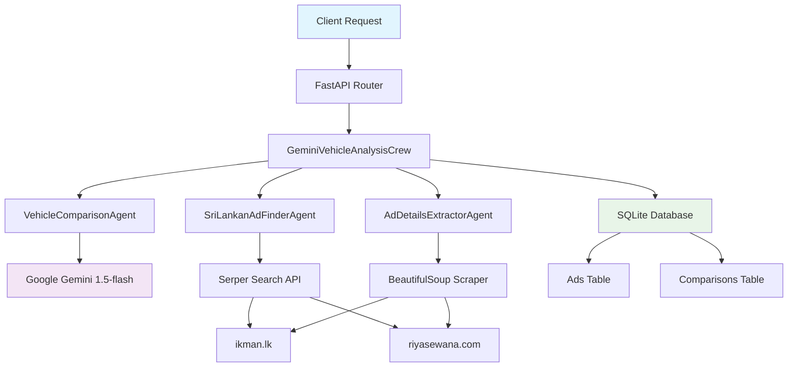

# 🚗 AI Vehicle Comparison System - Backend

[](https://python.org)
[](https://fastapi.tiangolo.com)
[](https://crewai.com)
[](https://ai.google.dev)
[](LICENSE)

> A production-ready FastAPI backend service powered by intelligent AI agents for vehicle comparison and local advertisement discovery in Sri Lanka.

## 📋 Table of Contents

- [🌟 Features](#-features)
- [🏗️ Architecture Overview](#️-architecture-overview)
- [🚀 Quick Start](#-quick-start)
- [📁 Project Structure](#-project-structure)
- [🔧 API Endpoints](#-api-endpoints)
- [🤖 AI Agents](#-ai-agents)
- [🛠️ Debugging Guide](#️-debugging-guide)
- [🔍 Logging and Monitoring](#-logging-and-monitoring)
- [🚨 Error Handling](#-error-handling)
- [🔧 Configuration](#-configuration)
- [📊 Performance Optimization](#-performance-optimization)
- [🧪 Testing](#-testing)
- [🚀 Deployment](#-deployment)
- [📝 Development Workflow](#-development-workflow)
- [🤝 Contributing](#-contributing)
- [📞 Support](#-support)
- [📄 License](#-license)

## 🌟 Features

- **🤖 AI-Powered Analysis**: Uses Google Gemini 1.5-flash with CrewAI agents for intelligent vehicle comparisons
- **🔍 Smart Web Scraping**: Automated discovery of vehicle listings from popular Sri Lankan websites
- **📊 Real-time Data**: Live price analysis and market insights
- **🛡️ Robust Error Handling**: Comprehensive error management with graceful degradation
- **🚀 High Performance**: Asynchronous processing with optimized database operations
- **📈 RESTful API**: Well-documented endpoints with OpenAPI/Swagger integration
- **🔧 Developer Friendly**: Extensive debugging tools and comprehensive logging

## 🏗️ Architecture Overview



### System Components

| Component | Technology | Purpose |
|-----------|------------|----------|
| **API Layer** | FastAPI | RESTful API endpoints with async support |
| **AI Orchestration** | CrewAI | Multi-agent workflow coordination |
| **Language Model** | Google Gemini 1.5-flash | Vehicle analysis and comparison |
| **Web Search** | Serper API | Finding vehicle listings online |
| **Web Scraping** | BeautifulSoup + Requests | Extracting structured data from websites |
| **Database** | SQLite + SQLAlchemy | Data persistence and ORM |
| **Configuration** | Pydantic + python-dotenv | Environment and settings management |
| **Logging** | Structlog + Coloredlogs | Comprehensive logging and monitoring |

## 🚀 Quick Start

### Prerequisites
- Python 3.8+
- pip
- Virtual environment (recommended)

### Installation

1. **Clone and navigate to the backend directory:**
   ```bash
   cd backend
   ```

2. **Create and activate virtual environment:**
   ```bash
   # Windows
   python -m venv venv
   .\venv\Scripts\activate
   
   # macOS/Linux
   python -m venv venv
   source venv/bin/activate
   ```

3. **Install dependencies:**
   ```bash
   pip install -r requirements.txt
   ```

4. **Set up environment variables:**
   Create a `.env` file in the backend directory:
   ```env
   # LLM Provider Configuration
   LLM_PROVIDER=gemini  # gemini, openai, or auto
   
   # Google Gemini Configuration (Primary)
   GEMINI_API_KEY=your_gemini_api_key_here
   GOOGLE_API_KEY=your_gemini_api_key_here  # Same as GEMINI_API_KEY
   GEMINI_MODEL=gemini-1.5-flash
   
   # Search Tool Configuration
   SERPER_API_KEY=your_serper_api_key_here
   
   # Mock Mode Configuration (for testing)
   USE_MOCK_CREW=false  # Set to true to force mock mode
   
   # Database Configuration
   DATABASE_URL=sqlite:///./ads.db
   ```

5. **Initialize the database:**
   
   The system uses SQLite as the default database to store vehicle advertisements and comparison results. You need to initialize the database before running the application.
   
   **Method 1: Using the initialization script (Recommended)**
   ```bash
   python "debugging/db debugging/init_db.py"
   ```
   
   **Method 2: Manual initialization (if needed)**
   ```python
   # Run this Python script to create tables manually
   from app.core.db import engine
   from app.models.ad import Base
   from app.models.comparison import Base as ComparisonBase
   
   # Create all tables
   Base.metadata.create_all(bind=engine)
   ComparisonBase.metadata.create_all(bind=engine)
   ```
   
   **Database Schema:**
   - **ads** table: Stores scraped vehicle advertisements
     - `id`: Primary key
     - `title`: Advertisement title
     - `price`: Vehicle price
     - `location`: Vehicle location
     - `mileage`: Vehicle mileage
     - `year`: Manufacturing year
     - `link`: Original advertisement URL
     - `vehicle_model`: Vehicle model name
     - `created_at`: Timestamp
   
   - **comparisons** table: Stores vehicle comparison results
     - `id`: Primary key
     - `vehicle1`: First vehicle name
     - `vehicle2`: Second vehicle name
     - `comparison_report`: Generated comparison report
     - `created_at`: Timestamp
   
   **Verify Database Creation:**
   ```bash
   # Check if database file was created
   ls -la ads.db
   
   # Inspect database structure (optional)
   python debugging/db\ debugging/inspect_ads_db.py
   ```

6. **Run the server:**
   ```bash
   python -m uvicorn app.main:app --reload --port 8080 --host 0.0.0.0
   ```

7. **Quick Test:**
   Open your browser and navigate to:
   - **API Documentation**: http://localhost:8080/docs (Swagger UI)
   - **Health Check**: http://localhost:8080/ 
   - **Alternative Documentation**: http://localhost:8080/redoc (ReDoc)
   
   Test the main endpoint:
   ```bash
   curl -X POST "http://localhost:8080/api/v1/analyze-vehicles" \
        -H "Content-Type: application/json" \
        -d '{"vehicle1": "Toyota Aqua", "vehicle2": "Honda Fit"}'
   ```

## 📁 Project Structure

```
backend/
├── app/
│   ├── __init__.py
│   ├── main.py                      # FastAPI application entry point
│   ├── gemini_crew.py               # Gemini crew configuration with LiteLLM routing
│   ├── tasks.py                     # Task definitions for agents
│   ├── agents/
│   │   ├── __init__.py
│   │   ├── ad_finder_agent.py       # Ad finding agent
│   │   ├── comparison_agent.py      # Vehicle comparison agent
│   │   ├── details_extractor_agent.py # Ad details extraction agent
│   │   └── mcp_enhanced_agent.py    # MCP-enhanced agent with tool support
│   ├── core/
│   │   ├── __init__.py
│   │   ├── config.py                # Configuration management
│   │   └── db.py                    # Database configuration
│   ├── crud/
│   │   ├── __init__.py
│   │   ├── ad_crud.py               # Ad CRUD operations
│   │   └── comparison_crud.py       # Comparison CRUD operations
│   ├── models/
│   │   ├── __init__.py
│   │   ├── ad.py                    # SQLAlchemy Ad model
│   │   └── comparison.py            # SQLAlchemy Comparison model
│   ├── schemas/
│   │   ├── __init__.py
│   │   └── vehicle_schemas.py       # Pydantic models
│   ├── tools/
│   │   ├── __init__.py
│   │   ├── search_helper.py         # Search helper utilities
│   │   ├── search_tool.py           # Serper search tool
│   │   ├── sri_lankan_scraper.py    # SriLankan website scraper
│   │   ├── sync_ad_details_tool.py  # Synchronous ad details extractor
│   │   └── sync_beautifulsoup_scraper.py # BeautifulSoup-based scraper
│   └── utils/
│       └── ad_stats.py              # Ad statistics utilities
├── debugging/
│   ├── api debugging/
│   │   └── test_gemini_direct.py    # Direct Gemini API testing
│   ├── db debugging/
│   │   ├── force_clear_db.py        # Database clearing utility
│   │   ├── init_db.py               # Database initialization script
│   │   ├── inspect_ads_db.py        # Database inspection tool
│   │   └── query_ads_db.py          # Database query utility
│   ├── tools debugging/
│   │   ├── test_detailed_scraper.py # Detailed scraper testing
│   │   ├── test_scraper.py          # Basic scraper testing
│   │   ├── test_simple_extractor.py # Simple extractor testing
│   │   ├── test_sri_lankan_scraper.py # Sri Lankan scraper testing
│   │   ├── test_sync_extractor.py   # Sync extractor testing
│   │   └── test_sync_scraper.py     # Sync scraper testing
│   └── README.md                    # Debugging documentation
├── .env                             # Environment variables (create this)
├── .env.example                     # Environment variables template
├── .gitignore
├── ads.db                           # SQLite database file
├── ER_backend.md                    # Backend engineering requirements
├── mcp-config.json                  # MCP configuration
├── README.md                        # This documentation
├── requirements.txt                 # Python dependencies
├── run.md                           # Quick run instructions
```

## 🔧 API Endpoints

### POST `/api/v1/analyze-vehicles`

Analyzes two vehicle models and finds local advertisements.

**Request Body:**
```json
{
  "vehicle1": "Toyota Aqua",
  "vehicle2": "Honda Fit"
}
```

**Response:**
```json
{
  "comparison_report": "Detailed markdown comparison...",
  "vehicle1_ads": [
    {
      "title": "Toyota Aqua 2018",
      "price": "LKR 6,500,000",
      "location": "Colombo",
      "mileage": "45,000 km",
      "year": "2018",
      "link": "https://ikman.lk/..."
    }
  ],
  "vehicle2_ads": [...]
}
```

### GET `/`

Health check endpoint.
```json
{
  "message": "Welcome to the AI Vehicle Analyst API"
}
```

### GET `/api/v1/health`

Detailed health check with service status.
```json
{
  "status": "healthy",
  "timestamp": "2025-08-01T14:55:32Z",
  "version": "1.0.0",
  "services": {
    "api": "operational",
    "openai_configured": true,
    "serper_configured": true,
    "mock_mode": false
  }
}
```

### POST `/api/v1/vehicle-ads-stats`

Filter ads and return price statistics.

**Request Body:**
```json
{
  "ads": [
    {
      "title": "Toyota Aqua 2018",
      "price": "LKR 6,500,000",
      "location": "Colombo",
      "mileage": "45,000 km",
      "year": "2018"
    }
  ],
  "min_price": 5000000,
  "max_price": 8000000,
  "year": 2018,
  "location": "Colombo"
}
```

### POST `/api/v1/test-openai`

Test OpenAI API connectivity (development/debugging endpoint).
```json
{
  "status": "success",
  "message": "OpenAI API connection successful",
  "model": "gpt-3.5-turbo",
  "response": "OK",
  "tokens_used": 5
}
```

## 🤖 AI Agents

### 1. VehicleComparisonAgent
- **Role:** Expert Car Reviewer
- **Goal:** Compare technical specifications, reliability, and expert reviews
- **Output:** Markdown-formatted comparison report

### 2. SriLankanAdFinderAgent
- **Role:** Local Vehicle Market Analyst
- **Goal:** Find active sale listings on Sri Lankan websites
- **Target Sites:** ikman.lk, riyasewana.com
- **Output:** List of advertisement URLs

### 3. AdDetailsExtractorAgent
- **Role:** Ad Data Extractor
- **Goal:** Extract structured data from advertisement pages
- **Output:** JSON objects with price, location, mileage, year, etc.


### Debug Mode

Run with debug logging:
```bash
uvicorn app.main:app --reload --host 0.0.0.0 --port 8080 --log-level debug
```


### Monitor Agent Execution
The CrewAI agents run with `verbose=True`, so you'll see detailed execution logs in the console.

## 🚨 Error Handling

### Common Error Responses

#### 400 Bad Request
```json
{
  "detail": "Both vehicle1 and vehicle2 must be provided."
}
```

#### 500 Internal Server Error
```json
{
  "detail": "An internal server error occurred."
}
```
``

## 🔧 Configuration

### Environment Variables
| Variable | Description | Required |
|----------|-------------|----------|
| `GEMINI_API_KEY` | Google Gemini API key for LLM | Yes |
| `SERPER_API_KEY` | Serper API key for web search | Yes |
| `USE_MOCK_CREW` | Force mock mode for testing | No |

### Configuration File
Edit `app/core/config.py` to add more configuration options:
```python
class Settings:
    OPENAI_API_KEY = os.getenv("OPENAI_API_KEY")
    SERPER_API_KEY = os.getenv("SERPER_API_KEY")
    
    # Add custom settings
    MAX_ADS_PER_VEHICLE = int(os.getenv("MAX_ADS_PER_VEHICLE", "5"))
    REQUEST_TIMEOUT = int(os.getenv("REQUEST_TIMEOUT", "300"))
```

## 📊 Performance Optimization

### 1. Parallel Processing
The crew currently runs sequentially. To enable parallel processing:
```python
# In app/gemini_crew.py
crew = Crew(
    agents=[...],
    tasks=[...],
    process=Process.hierarchical,  # or Process.sequential
    verbose=2
)
```


## 🧪 Testing

### Manual Testing
The system can be tested manually using the debugging scripts in the `debugging/` directory:

**Test individual components:**
```bash
# Test Gemini API connection
python "debugging/api debugging/test_gemini_direct.py"

# Test scrapers
python "debugging/tools debugging/test_sync_scraper.py"
python "debugging/tools debugging/test_sri_lankan_scraper.py"

# Test database
python "debugging/db debugging/inspect_ads_db.py"
```

### Setting up Automated Tests (Optional)
To add automated testing, install pytest and create test files:
```bash
# Install testing dependencies
pip install pytest pytest-asyncio httpx

# Create tests directory
mkdir tests
```

**Example unit test:**
```python
# tests/test_agents.py
import pytest
from app.agents.comparison_agent import VehicleComparisonAgent

def test_comparison_agent_creation():
    agent = VehicleComparisonAgent().expert_reviewer()
    assert agent.role == "Expert Car Reviewer"
```

**Example API test:**
```python
# tests/test_api.py
from fastapi.testclient import TestClient
from app.main import app

client = TestClient(app)

def test_health_check():
    response = client.get("/")
    assert response.status_code == 200
    assert response.json()["message"] == "Welcome to the AI Vehicle Analyst API"
```

Run tests:
```bash
pytest tests/ -v
```

## 🚀 Deployment

### Docker Deployment
Create `Dockerfile`:
```dockerfile
FROM python:3.9-slim

WORKDIR /app
COPY requirements.txt .
RUN pip install -r requirements.txt

COPY . .
EXPOSE 8080

CMD ["uvicorn", "app.main:app", "--host", "0.0.0.0", "--port", "8080"]
```

### Production Settings
```bash
# Use production server
uvicorn app.main:app --host 0.0.0.0 --port 8080 --workers 4

# Or with Gunicorn
gunicorn app.main:app -w 4 -k uvicorn.workers.UvicornWorker --bind 0.0.0.0:8080
```

## 📝 Development Workflow

### 1. Feature Development
```bash
# Create feature branch
git checkout -b feature/new-agent

# Make changes
# Test locally
python -m uvicorn app.main:app --reload --port 8080 --host 0.0.0.0
# Commit changes
git add .
git commit -m "Add new agent feature"
```

### 2. Code Quality
```bash
# Install development dependencies
pip install black flake8 mypy

# Format code
black app/

# Lint code
flake8 app/

# Type checking
mypy app/
```

## 🤝 Contributing

1. Fork the repository
2. Create a feature branch
3. Make your changes
4. Add tests
5. Submit a pull request

## 📞 Support

For issues and questions:
1. Check the debugging guide above
2. Review the logs for error messages
3. Test individual components
4. Create an issue with detailed error information

## 📄 License

This project is licensed under the MIT License. 